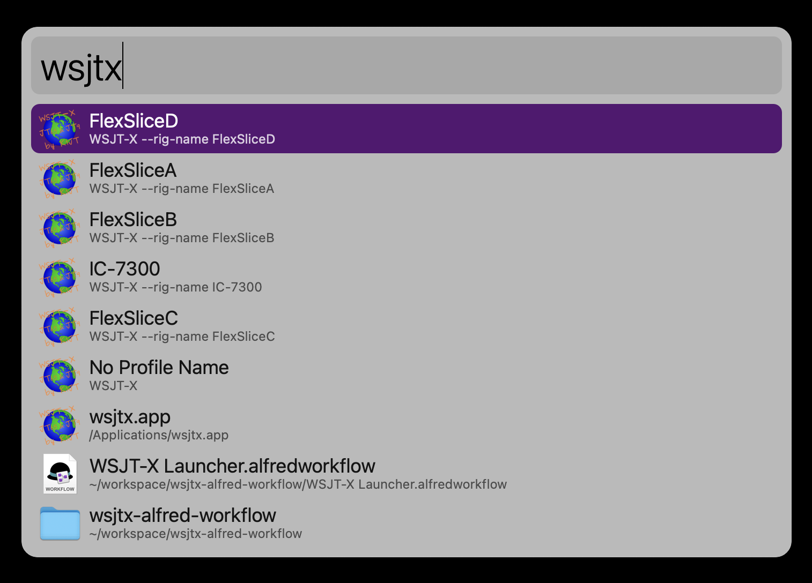

# wsjtx-alfred-workflow
An Alfred workflow to launch WSJT-X with any rig-name profile you have installed

## Screenshot

## Pre-req
Install Alfred - https://www.alfredapp.com

## Workflow Install
Double-click on the `WSJT-X Launcher.alfredworkflow` file

## Usage
1. Invoke Alfred with your shortcut
2. Type `wsjtx` into the bar
3. Use the arrow keys or shortcut to launch the WSJT-X rig-name instance you want

## Version History
1.0.0 - 2022-08-27 - Initial Release